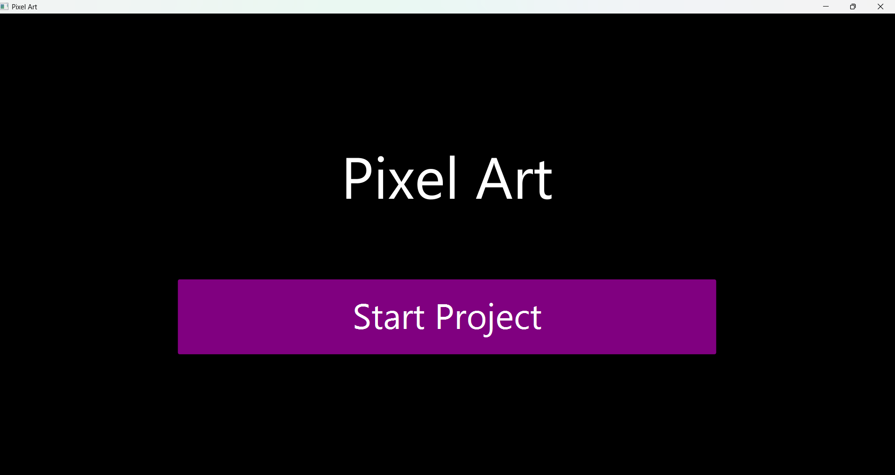
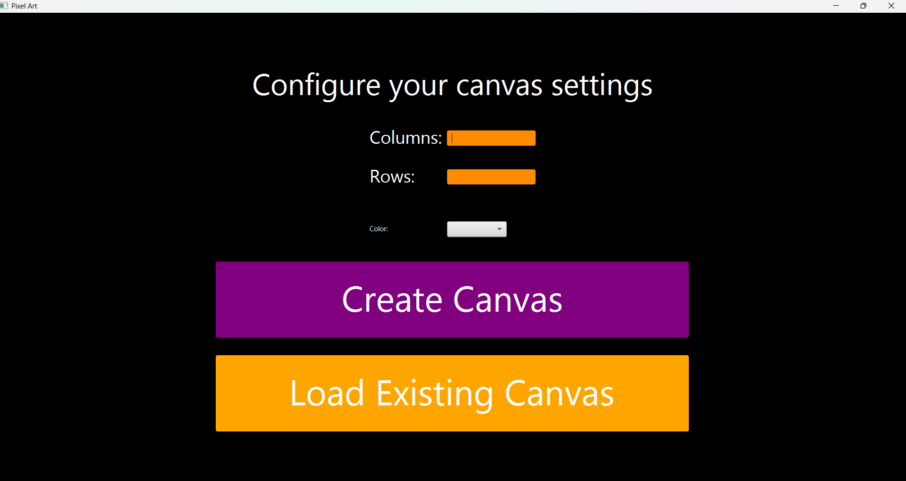
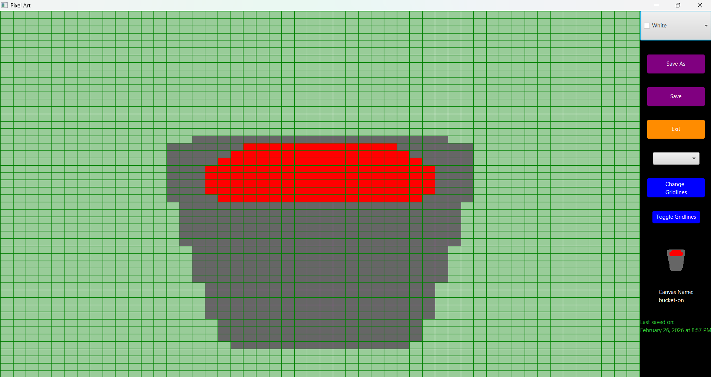

# Pixel Art

## Description
This my own pixel art editor completely free to anyone who wants to give it a try. This application lets the user create pixel art, with or without grids, and allows them to save and load that art. When it is saved, it is exported as a png into the Saved_Images directory in the project. The data for each artwork is stored in a text file and is used to load the art for editing at any time. The art's data is saved in the Saved_Images_Data directory in the project.

## Features
#### Painting:
The user can click a cell to change its color. A user can also hold down their mouse and drag across multiple cells, changing every cell in the path's color. There is also a paint bucket that allows for quick filling of one color. 

#### Saving:
The user can save their art by clicking the save or save as buttons. This will automatically create the data file needed to load the art again, as well as create a PNG of the art. All PNGs are saved to the Saved_Images directory.

#### Loading:
The user can load their past art by choosing to load an existing canvas during project initialization. This will read the appropriate data file and rebuild the art in an editable format. To successfully load art, it is critical that the saved data file for it remains in the Saved_Images_Data directory. 

#### Others:
When painting, the user will also have the options to toggle gridlines, as well as change the gridline's color. When editing, the name of the art and the date it was last modified is visible. 

## Getting Started:
#### Prerequisites:
Java 11 or higher <br>
JavaFX SDK (any openjfx distribution version 17 or higher) <br>

Include the bin and lib folders from your openjfx distribution in this project's directory!

#### Installation:
```
git clone https://github.com/alexramirez11/PixelArt.git 
cd PixelArt
```

#### Run the App:
```
javac --module-path lib --add-modules javafx.controls,javafx.swing *.java
java --module-path lib --add-modules javafx.controls,javafx.swing Driver
```

## Demo:
#### Start Menu:


#### Initialize Project:


#### Editing an existing artwork:


